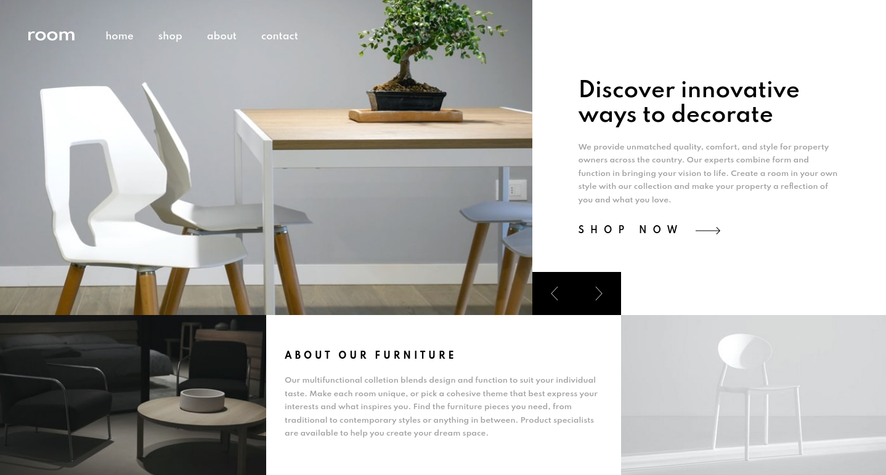

# Frontend Mentor - Room homepage solution

This is a solution to the [Room homepage challenge on Frontend Mentor](https://www.frontendmentor.io/challenges/room-homepage-BtdBY_ENq). Frontend Mentor challenges help you improve your coding skills by building realistic projects.

## Table of contents

-   [Overview](#overview)
    -   [The challenge](#the-challenge)
    -   [Screenshot](#screenshot)
    -   [Links](#links)
-   [My process](#my-process)
    -   [Built with](#built-with)
    -   [What I learned](#what-i-learned)
    -   [Continued development](#continued-development)
    -   [Useful resources](#useful-resources)

**Note: Delete this note and update the table of contents based on what sections you keep.**

## Overview

### The challenge

Users should be able to:

-   View the optimal layout for the site depending on their device's screen size
-   See hover states for all interactive elements on the page
-   Navigate the slider using either their mouse/trackpad or keyboard

### Screenshot



### Links

-   Solution URL: [LINK](https://www.frontendmentor.io/solutions/room-homepage-vanilla-javascript-scss-grid-flexbox-6IRh1CdIO)
-   Live Site URL: [LINK](https://conradmcgrifter.github.io/room-homepage)

## My process

### Built with

-   Flexbox
-   CSS Grid
-   scss

### What I learned

I learned to try and never put a fixed height on things. I had my main grid container with a height of 100% and it wasnt adapting properly when the screen was zoomed in and the text got bigger (it started to overflow). I added a min-height of 75rem + the height:100%; and this solved the problem

```css
.grid--container {
    height: 100%;
    min-height: 75rem;
    display: grid;
    grid-template-columns: 1fr;
    grid-template-rows: 66% 34%;
}
```

### Continued development

I plan on changing the carousel so that them images slide over eachother

### Useful resources

-   [javaScript Carousel](https://www.w3schools.com/howto/howto_js_slideshow.asp) - This helped me with understanding how to make an image carousel.
    concept.
